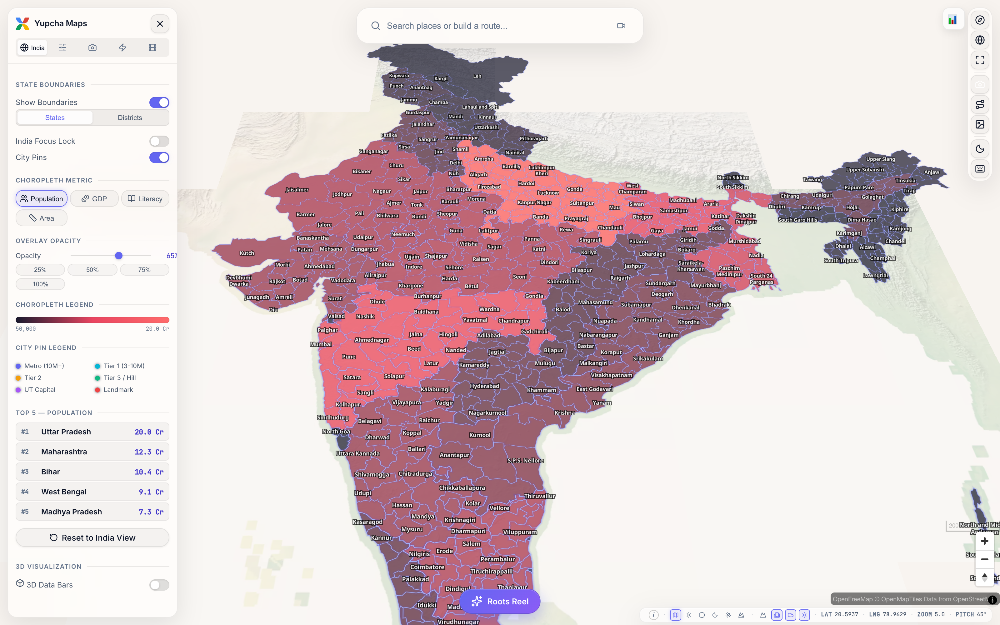
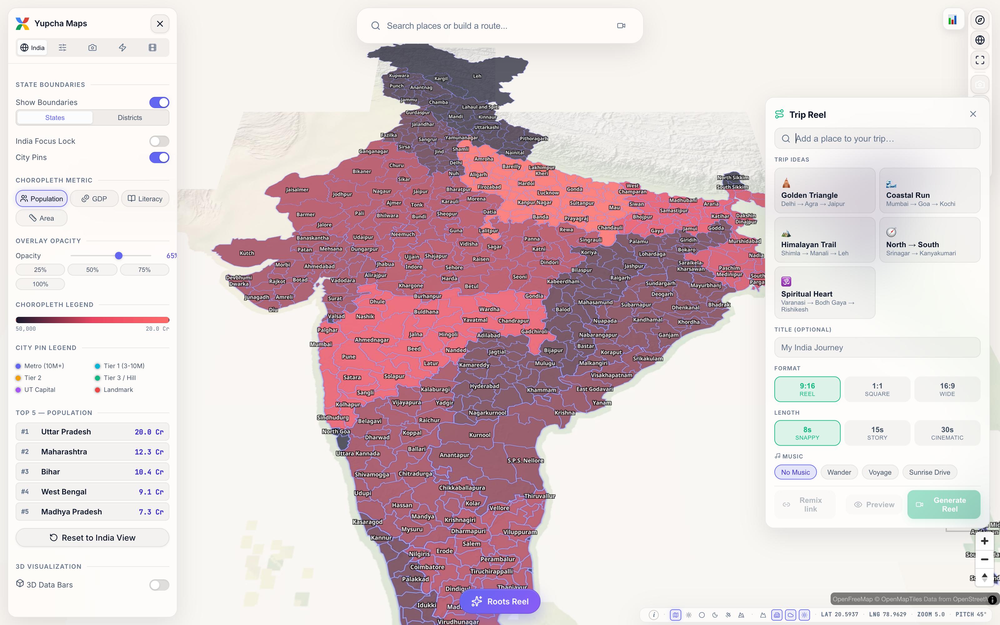
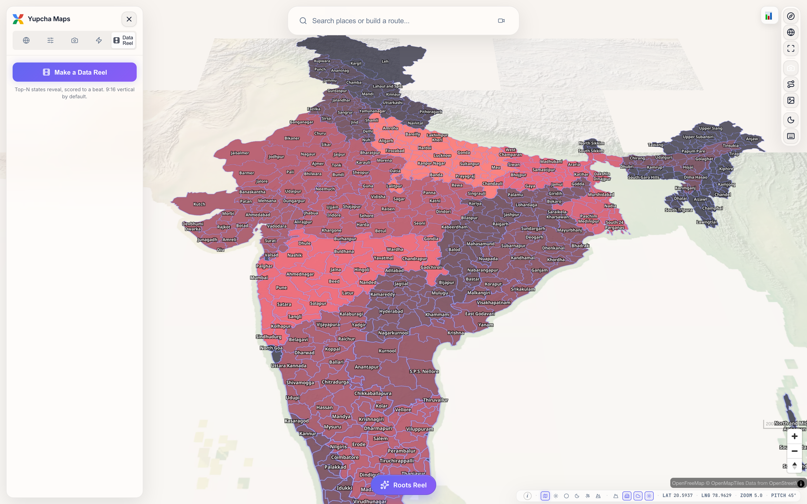
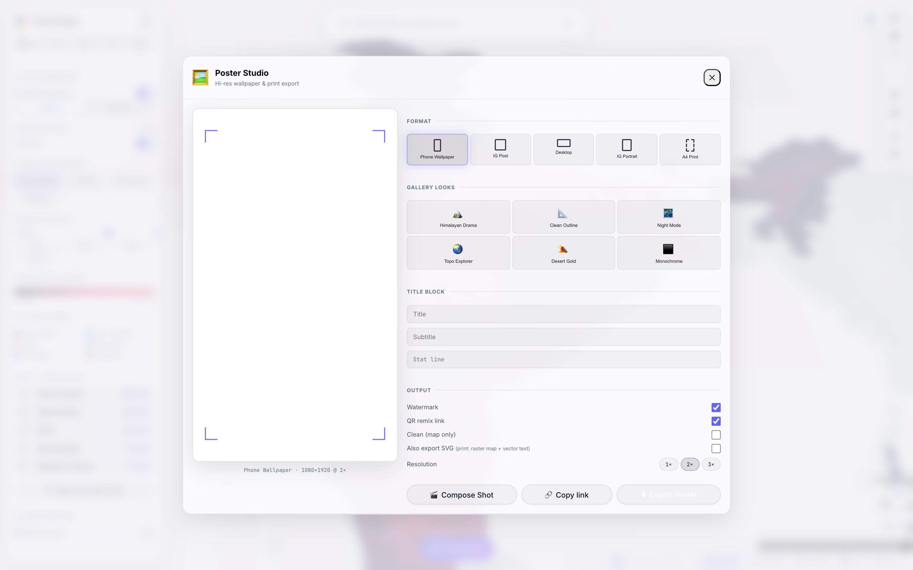

<div align="center">
  
  <h1>Yupcha Maps</h1>
  <p><strong>A map content factory for India.</strong> Turn any place, route, or dataset into a beautiful, shareable reel or poster — in seconds.</p>
  <p>
    <a href="https://maps.yupcha.com"><strong>🌐 Live app → maps.yupcha.com</strong></a>
  </p>
  <p>
    <a href="https://maps.yupcha.com"></a>
    <a href="LICENSE"></a>
    
    
    
  </p>
  <br />
  <a href="https://maps.yupcha.com">
    
  </a>
</div>

---

Google Maps is a navigation utility. **Yupcha Maps** is for *making things you want to post*: cinematic map videos, data flexes, and framable prints — all India-native, all in the browser, no GPU farm or pro tools required.

## ✨ Features

- **🌍 Roots Reel** — a one-tap emotional zoom from space down to your hometown rooftop, with a name/title overlay. Diaspora and regional-pride gold.
- **🛣️ Trip Reel** — paste an itinerary and get an animated route-line flight between stops, with distance/label stamps and ready-made templates (Golden Triangle, Manali–Leh, and more).
- **📊 Data Reel** — animated "Top-N states by metric" reveal with on-map choropleth staggering and counting-up numbers, scored to a beat.
- **🖼️ Poster / Wallpaper Export** — high-res styled SVG + PNG prints (phone wallpaper, IG post, A4) with a title block, watermark, and a QR code that links back to the live scene.
- **Shared reel foundation** — multi-aspect export (**9:16 / 1:1 / 16:9**), text/watermark overlays, beat-sync timing, and **remixable scene-links** (every export encodes its scene into a URL that reopens and can be tweaked).
- **Map toolkit** — choropleths (population, GDP, literacy, area), city pins, 3D buildings & terrain, satellite/vector styles, and a cinematic camera studio.

## 📸 Screenshots

| Trip Reel | Data Reel | Poster Studio |
| :---: | :---: | :---: |
|  |  |  |

## 🚀 Quick start

Requires Node 18+ (the repo uses [Bun](https://bun.sh) and npm lockfiles; either works).

```sh
git clone https://github.com/Yupcha/CreatorMaps.git
cd CreatorMaps
npm install
npm run dev        # http://localhost:5173
```

No API keys are needed — the basemap is served by [OpenFreeMap](https://openfreemap.org).

### Optional configuration

Analytics and error tracking are off by default. To enable them, copy the example env file and fill in your keys:

```sh
cp .env.example .env
```

| Variable | Purpose |
| --- | --- |
| `PUBLIC_POSTHOG_KEY` | [PostHog](https://posthog.com) product analytics (optional) |
| `PUBLIC_SENTRY_DSN` | [Sentry](https://sentry.io) error tracking (optional) |

## 🛠️ Build & deploy

```sh
npm run build      # production build (Cloudflare adapter)
npm run preview    # preview the production build locally
npm run check      # type-check with svelte-check
```

The project ships with `@sveltejs/adapter-cloudflare` and a `wrangler.toml` for Cloudflare Pages.

## 🧱 Tech stack

[SvelteKit 2](https://svelte.dev/docs/kit) · [Svelte 5](https://svelte.dev) (runes) · [Vite](https://vite.dev) · [MapLibre GL](https://maplibre.org) · [deck.gl](https://deck.gl) · [Threlte](https://threlte.xyz)/[three.js](https://threejs.org) · [Plotly](https://plotly.com/javascript/) · [Turf](https://turfjs.org) · [PGlite](https://pglite.dev) · TypeScript.

## 📍 Attribution

Basemap tiles © [OpenFreeMap](https://openfreemap.org) and [OpenStreetMap](https://www.openstreetmap.org/copyright) contributors, available under the [ODbL](https://opendatacommons.org/licenses/odbl/). Please keep map attribution visible in any deployment.

## 📄 License

[MIT](LICENSE) © 2026 Yupcha
